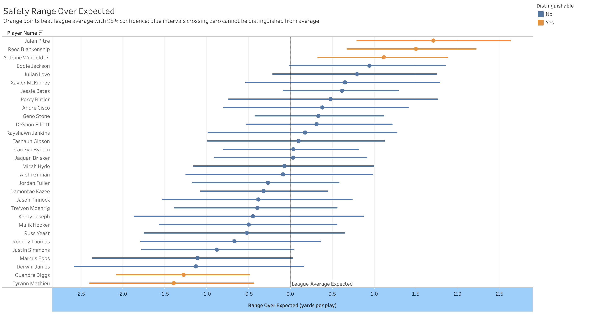
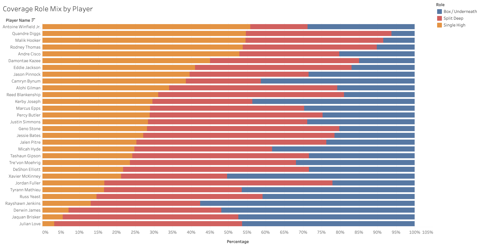
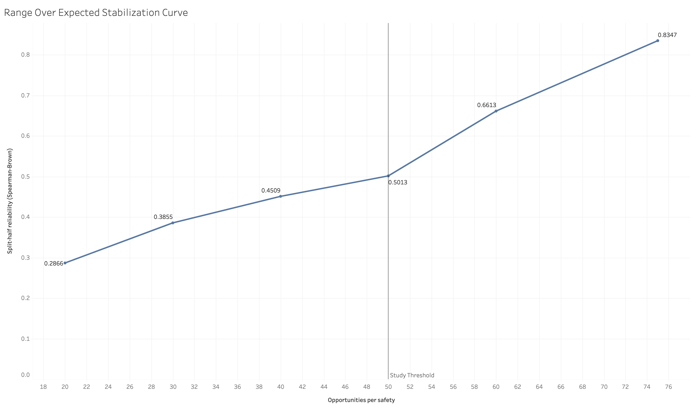

# Lone Ranger
### Quantifying Safety Range with NFL Player Tracking Data

Lone Ranger is an analytics project that asks a simple question about NFL safeties and answers it carefully: **can we measure a safety's "range" (their ability to cover ground and close in on the football) as a real, repeatable skill, separate from the situations they happen to be put in?**

It is built on the 2026 NFL Big Data Bowl player-tracking dataset (2023 season). The headline metric is **Range Over Expected (ROE)**: how many yards a safety closes toward the ball's landing point, above or below what an average deep safety would close from the same situation.

> **Note on scope:** This project was *not* submitted to the Big Data Bowl competition (it had already closed). It was built to the competition's judging standards as a portfolio piece, with a deliberate emphasis on doing the statistics honestly rather than producing an impressive-looking leaderboard.

---

## Core Idea

Raw "distance closed" is a bad measure of safety skill, because most of it is opportunity, not ability. A safety who starts 25 yards from the ball on a long, slow-developing deep shot will close a lot of ground regardless of talent; a safety asked to defend a quick throw into his zone has almost no ground to cover. In this data, roughly **60% of the variation in raw distance closed is explained by situation alone** (starting distance, time the ball is in the air, and alignment).

ROE strips that away. An "expected" model predicts how much ground an average deep safety would close given the pre-throw situation, and ROE is the residual, the part that isn't explained by circumstance. That residual is the candidate skill signal, and most of this project is spent testing whether it is actually a skill or just noise.

---

## What Was Found

- **Range is measurable and moderately repeatable.** Split-half reliability is **0.58** (Spearman-Brown corrected) over a single season — clearly real signal, but with meaningful noise at the individual level.
- **We can confidently identify the top rangey safeties, but not rank everyone precisely.** Of the **30** safeties with enough opportunities to study, only **5** (3 clearly above average and 2 clearly below) have Range Over Expected confidence intervals that exclude zero — i.e. are statistically distinguishable from an average deep safety. The metric supports "who's clearly elite," not "who's #14 vs #15."
- **The signal survives falsification.** When player identities are randomly shuffled, the between-safety spread collapses to a noise floor and the real spread sits far outside it (**permutation p = 0.0002**). The player differences are not an artifact of how the metric is distributed.
- **Reliability rises cleanly with sample size**, which both justifies the study's opportunity threshold and suggests the metric would sharpen considerably with more data (multiple seasons, or fuller tracking coverage).

Summary: **Safety range is a real, moderately reliable skill that this single season of partial-coverage tracking data can measure at the top end but not resolve player-by-player.**

---

## Project Limitations

These are stated plainly because the credibility of the finding depends on being honest about them. Several are structural to the dataset and would constrain *any* safety-range project built on it.

- **Partial post-throw tracking.** The Big Data Bowl release only provides post-throw trajectories for players flagged `player_to_predict` — a small subset of the defense. Deep safeties are often far from the ball and frequently aren't in that subset, so **~75% of deep-coverage snaps have no usable trajectory.** This is the single biggest constraint and it caps how much data any safety accumulates.
- **Small study population.** After requiring enough measurable opportunities (≥50 eligible snaps), the study population is **30 safeties**. That is enough for a focused study with confidence intervals, but not a league-wide leaderboard. Individual estimates carry wide uncertainty.
- **Single season.** Only 2023 is in scope, so all repeatability claims are *within-season* (split-half, first/second-half). This project makes **no claim about year-over-year stability**, which would require multiple seasons.
- **Coverage role is inferred, not labeled.** The data does not state each safety's individual assignment. A pre-snap classifier infers a coarse role (single-high / split-deep / box) from alignment; it agrees with the stated coverage shell ~67% of the time, and the disagreements (disguise, rotation) are a known source of noise.
- **"Range" is a joint skill.** Range blends reading the play early and closing once the ball is up. An attempt to numerically separate "anticipation" from "closing athleticism" was investigated and **deliberately dropped** since the available signal (velocity at the throw) was too mechanically entangled with the outcome to separate cleanly at this sample size. Range is therefore reported as a single joint measure, with any "reader-vs-athlete" lean discussed qualitatively rather than as a contested number.
- **The leaderboard is not a precise ranking.** Adjacent safeties' confidence intervals overlap heavily. Only top-vs-field distinctions are statistically supported.

---

## Methodology

The pipeline is built so each stage is checkable and the correctness-critical assumptions are verified against the data rather than assumed.

1. **Foundation & validation.** Ball-flight time is confirmed as `num_frames_output / 10` (frame rate verified at 10 Hz against the data). The safety population and per-safety opportunity counts are established.
2. **Role attribution.** A pre-snap classifier assigns each safety-play a coverage role from snap-frame depth and the number of deep safeties on the play, validated against the stated coverage shell.
3. **Frozen opportunity table.** The eligible deep-coverage opportunities are frozen into an immutable, checksummed table (one row per qualifying safety-play), so downstream work builds on a fixed sample.
4. **Geometry.** All distance, closing, path, and angle math lives in one unit-tested module (`geometry.py`, 27 passing tests), including the NFL tracking angle convention (0° = +y, clockwise) so direction features aren't silently corrupted.
5. **Features.** One pre-throw feature row per opportunity, with in-flight outcomes kept strictly separate from predictors to prevent leakage.
6. **Expected model + ROE.** Two model types (gradient boosting and an interpretable spline-ridge) predict expected distance closed from situation only, under **safety-grouped out-of-fold cross-validation** so a safety's ROE is never computed by a model that trained on him. The two models agree on the ranking at Spearman 0.99.
7. **Reliability, uncertainty, falsification.** Split-half reliability, bootstrap confidence intervals per safety, a stabilization curve, and a permutation/identity-shuffle falsification test.

**Populations (stated on purpose):** the expected model is *trained* on all play-eligible deep safeties (~146) so "expected" reflects a league-average safety, but ROE is only *reported* for the 30 safeties who clear the opportunity threshold.

---

## Repository Structure

```
Lone Ranger/
├── README.md                      
├── data/
│   ├── raw/                       NFL Big Data Bowl data (read-only, not tracked in git).
│   │   ├── train/                 input_2023_w[01-18].csv, output_2023_w[01-18].csv
│   │   └── supplementary_data.csv
│   ├── interim/                   Generated stepping-stone tables (rosters, role tables).
│   ├── processed/                 Frozen + final analytical tables.
│   └── tableau/                   Tidy exports for the Tableau dashboard.
├── src/                           The analysis pipeline (run in the order below).
├── tests/                         Unit tests.
└── docs/                          Project plan / supporting documents.
```

### Source Files (`src/`)

Listed in the order they run. Each reads from and writes to the correct `data/` subfolder automatically via `paths.py`.

| File | What it does |
|------|--------------|
| `paths.py` | Central path config. Defines the `raw` / `interim` / `processed` / `tableau` folder layout once and locates the project root, so every script runs from the repo root with no arguments. |
| `geometry.py` | Core measurement library (imported, not run directly). Distance, distance-closed, closing rate, path length/efficiency, coordinate normalization, and the NFL angle convention (velocity components, angle normalization, radial velocity toward the ball). |
| `count_safeties.py` | Counts the distinct safety population across all weeks. → `data/interim/` |
| `count_opportunities.py` | Counts range opportunities per safety and the opportunity-threshold distribution. → `data/interim/` |
| `role_classifier.py` | Pre-snap coverage-role classifier (single-high / split-deep / box) with shell cross-check. Accepts optional `--deep-depth`. → `data/interim/` |
| `freeze_opportunity_table.py` | Freezes the eligible deep-coverage opportunities into an immutable, checksummed table; sets the 50-opportunity study flag. → `data/processed/` |
| `build_features.py` | Builds one pre-throw + in-flight feature row per opportunity, using only `geometry.py`. → `data/processed/` |
| `expected_model.py` | Trains the expected-distance-closed models (out-of-fold, safety-grouped) and computes Range Over Expected per opportunity and per safety. → `data/processed/` |
| `reliability.py` | Split-half reliability, bootstrap confidence intervals, and the stabilization curve. → `data/processed/` |
| `falsification.py` | Permutation / identity-shuffle test that the range signal isn't a distributional artifact. → `data/processed/` |
| `build_tableau_exports.py` | Reshapes the final results into tidy tables for Tableau. → `data/tableau/` |

### Tests (`tests/`)

| File | What it does |
|------|--------------|
| `test_geometry.py` | 27 unit tests for `geometry.py`: hand-computed distances, the normalization distance-preserving invariant, and the full angle convention (0°=+y, clockwise). |

### Key Output Tables (`data/processed/`)

| File | Contents |
|------|----------|
| `opportunity_table_deep_v1.csv` | The frozen sample: one row per eligible deep-coverage safety-play, with role, flight time, and ball landing point. Checksummed by the `.md5` file beside it. |
| `features_deep_v1.csv` | One feature row per opportunity (pre-throw predictors + in-flight outcomes). |
| `roe_opportunity_v1.csv` | Per-opportunity expected values and Range Over Expected (both models). |
| `roe_per_safety_v1.csv` | Per-safety mean ROE (the leaderboard, point estimates). |
| `roe_with_cis_v1.csv` | Per-safety ROE with bootstrap 95% confidence intervals. |
| `stabilization_curve_v1.csv` | Reliability as a function of opportunities per safety. |
| `falsification_null_spread_v1.csv` | The shuffled-identity null distribution from the falsification test. |

---

## How to Run

### Requirements

- Python 3.10+
- `pip install pandas numpy scikit-learn`
- (For tests) `pip install pytest`
- The Big Data Bowl data placed in `data/raw/` (see structure above). The raw tracking files are not included in this repo, but can be sourced using the link below.

https://www.kaggle.com/competitions/nfl-big-data-bowl-2026-analytics/data

### Run the full pipeline

From the repository root, run in order:

```bash
python3 src/count_safeties.py
python3 src/count_opportunities.py
python3 src/role_classifier.py
python3 src/freeze_opportunity_table.py
python3 src/build_features.py
python3 src/expected_model.py
python3 src/reliability.py
python3 src/falsification.py
python3 src/build_tableau_exports.py
```

Each script prints a summary and writes its outputs to the appropriate `data/` subfolder. No arguments are needed; `paths.py` resolves all locations. (`role_classifier.py` optionally takes `--deep-depth` for a threshold-sensitivity check.)

### Run the tests

```bash
PYTHONPATH=src python3 -m pytest tests/ -v
```

All 27 geometry tests should pass. These verify the measurement foundation the rest of the project depends on.

---

## Tableau Dashboard

An interactive Tableau Public dashboard presents the results for exploration.

**Live Dashboard:** https://public.tableau.com/app/profile/evan.miller1143/viz/LoneRanger/LoneRanger

### Views

**Leaderboard with Confidence Intervals**<br>
The 30 reported safeties ranked by Range Over Expected, each with a 95% bootstrap interval, colored by whether they are statistically distinguishable from average.



**Coverage Role Mix**<br>
Each safety's split of single-high / split-deep / box snaps, showing that "safety" is several different jobs under one label and that range must be measured relative to role.



**Reliability Stabilization Curve**<br>
How the metric's reliability rises with the number of opportunities per safety — the empirical justification for the study's opportunity threshold.



**Field Trajectory View**<br>
Safety closing paths on the field from throw to arrival, with the ball landing point, illustrating high- vs low-ROE plays using the raw tracking data.

_[Work in Progress]_

---

## Acknowledgments & Data

Data: NFL Big Data Bowl 2026 (player tracking provided by NFL Next Gen Stats), 2023 season. External play-by-play context via nflverse where applicable.

This project is an independent portfolio piece and is not affiliated with the NFL or the Big Data Bowl.
